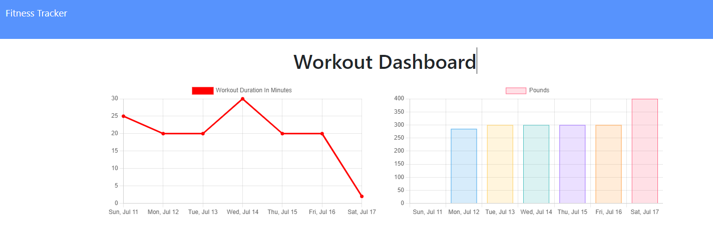

# Workout Tracker

## Description
 As a user, I want to be able to view create and track daily workouts. I want to be able to log multiple exercises in a workout on a given day. I should also be able to track the name, type, weight, sets, reps, and duration of exercise. If the exercise is a cardio exercise, I should be able to track my distance traveled.

## Table of Contents
- [Usage](#usage)
- [Deployed App](#deployed-app)
- [License](#license)  
- [Contribute](#contribute)
- [Questions](#questions)

## Usage
When the user loads the page, they are given the option to create a new workout or continue with their last workout.

The user is able to:

  * Add exercises to the most recent workout plan.

  * Add new exercises to a new workout plan.

  * View the combined weight of multiple exercises from the past seven workouts on the `stats` page.

  * View the total duration of each workout from the past seven workouts on the `stats` page.

## Deployed App
[https://github.com/stamm2911](https://github.com/stamm2911)

## License
© Licensed under the Apache License 2.0
## Contribute
In general, we follow the "fork-and-pull" Git workflow.

1. Fork the repo on GitHub
2. Clone the project to your own machine
3. Commit changes to your own branch
4. Push your work back up to your fork
5. Submit a Pull request so that we can review your changes
NOTE: Be sure to merge the latest from "upstream" before making a pull request
## Questions
Contact me:

- GitHub: [stamm2911](https://github.com/stamm2911)

- Email: edstamm29@gmail.com
    